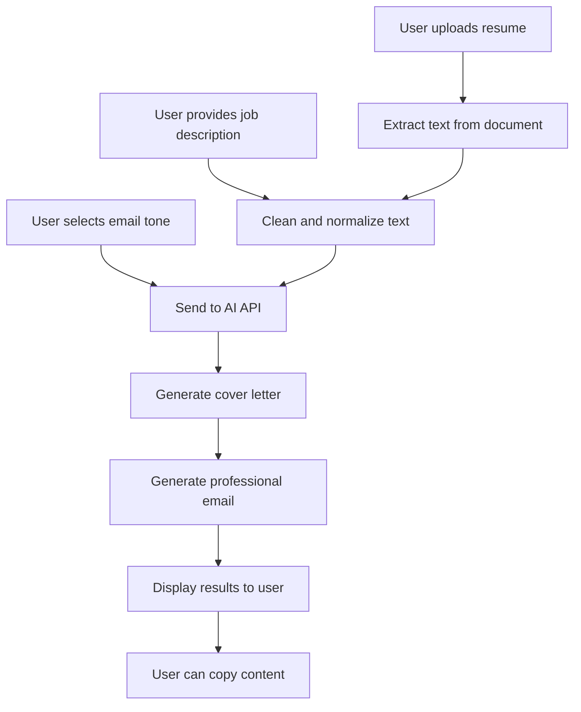

# 🚀 Easy-Apply - AI-Powered Job Application Assistant

Easy-Apply is a web-based application that streamlines the job application process by automating the creation of personalized cover letters and professional emails using AI technology.

## 📋 Table of Contents

- [Overview](#overview)
- [Features](#features)
- [How It Works](#how-it-works)
- [Technology Stack](#technology-stack)
- [Project Structure](#project-structure)
- [Installation](#installation)
- [Configuration](#configuration)
- [Usage](#usage)
- [API Integration](#api-integration)
- [Deployment](#deployment)
- [Contributing](#contributing)
- [License](#license)

## 🎯 Overview

Easy-Apply addresses the time-consuming process of creating customized job applications. Instead of spending hours crafting individual cover letters and emails for each position, users can upload their resume, provide a job description, and receive professionally written, tailored application materials in minutes.

### Key Benefits
- **Time Savings**: Reduce application time from hours to minutes
- **Professional Quality**: AI-generated content follows business letter standards
- **Customization**: Each output is tailored to the specific job requirements
- **Multiple Formats**: Supports both cover letters and follow-up emails
- **User-Friendly**: Simple web interface with drag-and-drop functionality

## ✨ Features

### 📄 Document Processing
- **Resume Upload**: Supports PDF and DOCX formats
- **Text Extraction**: Automatic parsing of resume content
- **Job Description Input**: Manual paste or LinkedIn URL extraction
- **File Validation**: Security checks and size limits

### 🤖 AI Content Generation
- **Cover Letters**: Professional business letter format
- **Email Generation**: Multiple tone options (formal, enthusiastic, direct)
- **Customization**: Content tailored to job requirements and user experience
- **Quality Control**: Built-in content filtering and formatting

### 🎨 User Interface
- **Modern Design**: Responsive interface built with Tailwind CSS
- **Dark Mode**: Toggle between light and dark themes
- **Mobile Friendly**: Optimized for all device sizes
- **Interactive Elements**: Progress indicators and real-time feedback

### 🔒 Security & Performance
- **Rate Limiting**: Prevents API abuse with configurable limits
- **In-Memory Processing**: Files never saved to disk for privacy
- **Session Management**: Secure handling of user data
- **Error Handling**: Robust error recovery and user feedback

## 🔄 How It Works



### Step-by-Step Process

1. **Upload Resume**: User uploads PDF or DOCX resume file
2. **Job Information**: User pastes job description or provides LinkedIn URL
3. **Customization**: User selects email tone (formal, enthusiastic, or direct)
4. **AI Processing**: Application sends data to OpenRouter API for content generation
5. **Content Generation**: AI creates tailored cover letter and email
6. **Results**: User receives formatted, professional application materials
7. **Copy & Use**: User can copy content for immediate use in applications

## 🛠 Technology Stack

### Backend
- **Flask 2.3.3**: Python web framework
- **Python 3.x**: Core programming language
- **Flask-Limiter 3.5.0**: Rate limiting and API protection
- **Requests 2.31.0**: HTTP library for API calls

### Document Processing
- **PyPDF2 3.0.1**: PDF text extraction
- **python-docx 0.8.11**: DOCX document processing
- **docx2txt 0.8**: Alternative DOCX text extraction
- **BeautifulSoup4 4.12.2**: HTML parsing for web scraping

### Frontend
- **HTML5**: Semantic markup
- **Tailwind CSS**: Utility-first CSS framework
- **JavaScript**: Interactive functionality
- **Font Awesome**: Icon library

### External Services
- **OpenRouter API**: AI content generation
- **Vercel**: Hosting and deployment platform

### Security & Utilities
- **cryptography 41.0.7**: Secure operations
- **python-dotenv 1.0.0**: Environment variable management
- **Werkzeug 2.3.7**: WSGI utilities

## 📁 Project Structure

```
Easy-Apply/
├── api/
│   └── index.py              # Vercel deployment entry point
├── templates/
│   ├── home.html             # Landing page
│   ├── index.html            # Main application interface
│   └── results.html          # Generated content display
├── static/
│   ├── favicon.ico           # Website icon
│   ├── favicon-16x16.png     # 16x16 favicon
│   ├── favicon-32x32.png     # 32x32 favicon
│   ├── apple-touch-icon.png  # Apple touch icon
│   └── site.webmanifest      # PWA manifest
├── app.py                    # Main Flask application
├── config.py                 # Configuration settings
├── requirements.txt          # Python dependencies
├── runtime.txt               # Python version specification
├── vercel.json              # Vercel deployment configuration
└── README.md                # Project documentation
```

## 🚀 Installation

### Prerequisites
- Python 3.8 or higher
- pip (Python package installer)
- OpenRouter API key

### Local Development Setup

1. **Clone the repository**
   ```bash
   git clone <repository-url>
   cd Easy-Apply
   ```

2. **Create virtual environment**
   ```bash
   python -m venv venv
   source venv/bin/activate  # On Windows: venv\Scripts\activate
   ```

3. **Install dependencies**
   ```bash
   pip install -r requirements.txt
   ```

4. **Environment configuration**
   ```bash
   # Create .env file
   echo "FLASK_SECRET_KEY=your-secret-key-here" > .env
   echo "OPENROUTER_API_KEY=your-openrouter-api-key" >> .env
   ```

5. **Run the application**
   ```bash
   python app.py
   ```

6. **Access the application**
   Open your browser and navigate to `http://localhost:5000`

## ⚙️ Configuration

### Environment Variables

| Variable | Description | Required |
|----------|-------------|----------|
| `FLASK_SECRET_KEY` | Secret key for Flask session management | Yes |
| `OPENROUTER_API_KEY` | API key for OpenRouter AI service | Yes |

### Application Settings

The `config.py` file contains the following configurable settings:

```python
class Config:
    SECRET_KEY = os.environ.get('FLASK_SECRET_KEY')
    OPENROUTER_API_KEY = os.environ.get('OPENROUTER_API_KEY')
    UPLOAD_FOLDER = 'uploads'
    ALLOWED_EXTENSIONS = {'pdf', 'docx'}
    MAX_CONTENT_LENGTH = 16 * 1024 * 1024  # 16MB max file size
    API_URL = "https://openrouter.ai/api/v1/chat/completions"
    MODEL = "openai/gpt-oss-20b:free"
    API_MAX_RETRIES = 3
    API_BASE_DELAY = 2  # Base delay in seconds for exponential backoff
```

## 📖 Usage

### Basic Workflow

1. **Access the Application**: Navigate to the homepage
2. **Upload Resume**: Click "Choose File" and select your PDF or DOCX resume
3. **Job Description**: Either:
   - Paste the job description directly, or
   - Provide a LinkedIn job posting URL
4. **Email Tone**: Select your preferred email tone:
   - **Formal**: Professional and traditional
   - **Enthusiastic**: Shows passion and excitement
   - **Short & Direct**: Concise and to-the-point
5. **Generate**: Click "Generate Application Materials"
6. **Review Results**: View your custom cover letter and email
7. **Copy Content**: Use the copy buttons to get the text for your applications

### File Requirements

- **Supported Formats**: PDF, DOCX
- **Maximum File Size**: 16MB
- **Content**: Should contain your work experience, skills, and education

### Job Description Input

- **Manual Entry**: Copy and paste job description text
- **LinkedIn URLs**: Provide LinkedIn job posting URL for automatic extraction
- **Content Quality**: More detailed job descriptions produce better results

## 🔌 API Integration

### OpenRouter API

Easy-Apply integrates with OpenRouter API for AI content generation:

- **Model**: `openai/gpt-oss-20b:free` (configurable)
- **Rate Limiting**: Built-in retry logic with exponential backoff
- **Error Handling**: Graceful failure handling with user feedback

### Rate Limiting

The application includes rate limiting to prevent abuse:

- **Default Limits**: 200 requests per day, 50 per hour
- **Per-User Limits**: 10 requests per minute for file uploads
- **Configurable**: Limits can be adjusted in the Flask-Limiter configuration

## 🌐 Deployment

### Vercel Deployment

The application is configured for deployment on Vercel:

1. **Install Vercel CLI**
   ```bash
   npm install -g vercel
   ```

2. **Login to Vercel**
   ```bash
   vercel login
   ```

3. **Deploy**
   ```bash
   vercel
   ```

4. **Set Environment Variables**
   ```bash
   vercel env add FLASK_SECRET_KEY
   vercel env add OPENROUTER_API_KEY
   ```

### Alternative Deployment Options

- **Heroku**: Compatible with Procfile and requirements.txt
- **Railway**: Direct GitHub integration
- **PythonAnywhere**: Flask application hosting
- **DigitalOcean App Platform**: Container-based deployment

## 🤝 Contributing

We welcome contributions to Easy-Apply! Here's how you can help:

### Development Setup

1. Fork the repository
2. Create a feature branch: `git checkout -b feature-name`
3. Make your changes
4. Add tests if applicable
5. Commit your changes: `git commit -m 'Add feature'`
6. Push to the branch: `git push origin feature-name`
7. Submit a pull request

### Areas for Contribution

- **UI/UX Improvements**: Enhanced user interface design
- **Additional File Formats**: Support for more document types
- **Language Support**: Multi-language content generation
- **Template Customization**: More cover letter templates
- **Performance Optimization**: Faster processing and response times

## 📄 License

This project is licensed under the MIT License - see the [LICENSE](LICENSE) file for details.

## 🆘 Support

If you encounter any issues or have questions:

1. Check the [Issues](../../issues) page for existing problems
2. Create a new issue with detailed information
3. Include error messages and steps to reproduce

## 🙏 Acknowledgments

- **OpenRouter**: For providing AI API services
- **Tailwind CSS**: For the utility-first CSS framework
- **Flask Community**: For the excellent web framework
- **Contributors**: Thanks to all who have contributed to this project

---

**Made with ❤️ for job seekers worldwide**

*Easy-Apply - Making job applications easier, one click at a time.*